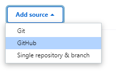
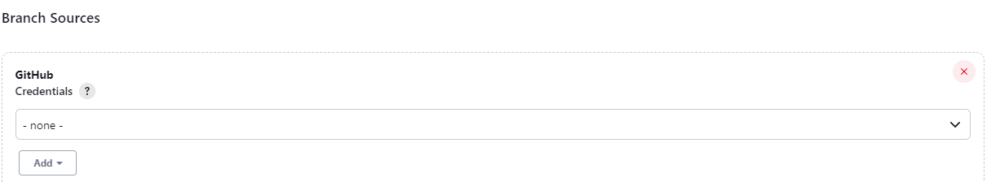

# Create jenkins pipelines

This project is split between three differents pipelines used to automate differents stages of a web application. You will be able to find:
- [branches-JenkinsFile](#branches-jenkins)
- [main-JenkinsFile](#main-jenkinsfile)
- [release-JenkinsFile](#releases)

This readme file is an introduction on the purpose of the pipelines and a tutorial to deploy them inside a jenkins master instance.

**Note** that our JenkinsFile are using the agent "Docker" which needs the Jenkins instance to have docker installed.

## Jenkins Plugin & Configuration

Before heading to the pipelines configurations, we have to configure jenkins itself. 

You can install plugins by going to: `Manage Jenkins > Manage Plugins > Available plugins`.

### Docker Pipeline

Our pipelines uses a `docker` agent to run. It means that Jenkins have to know what is this agent. The Docker Plugin gives all the information to jenkins, so no need to do anything more.

### GitHub

In order to have access to every github feaure we want, please install:
- GitHub API plugin
- GitHub Branch Source Plugin
- GitHub plugin

### Slack Notification Plugin

If you are using Slack as your team communication tool, our pipelines are working correctly with it. First, install the plugin.

Now, go to `Dashboard > Manage Jenkins > Credentials`.

Create a [Jenkins Credentials](https://www.jenkins.io/doc/book/using/using-credentials/) of type `secret text` named `slack`. In it, put the token returned to you by the [Jenkins slack integration page]( https://myspace.slack.com/services/new/jenkins-ci).

Then, you have to configure it. Go to `Dashboard > Manage Jenkins > Configure System`. Search for **Slack**.

In **Workspace**, enter the name of your slack workspace. in **Credentials**, please select the `slack` credential you just created.

⚠️ **If you do not want to use slack, please remove it from the jenkinsFiles before running them.** ⚠️

### Discord Notifier

If you opted for discord as a team communication tool, you have to install the **Discord notifier** plugin.

Then, go to discord and [create a webhook](https://discordjs.guide/popular-topics/webhooks.html#creating-webhooks). You can now head to `Dashboard > Manage Jenkins > Credentials` and create a new credential `secret text` called **discord-webhook.**  In the secret, paste your discord webhook.

⚠️ **If you do not want to use discord, please remove it from the jenkinsFiles before running them.** ⚠️

## Branches-Jenkins

### Purpose
This pipeline aims to automate the integration or refactorisation of code in every **non-main branch**.

It includes:
- unitary tests
- linting tests
- building tests

### Tutorial

In order to create the pipeline, follow the next steps:

1. Click **Add item**, enter `branches-pipeline` as the name and select "multri-branches pipeline".

2. In **Branch sources**, click add source, select "Git". A new Git Interface should appear.

3. In the section `Project Repository` paste your git repository url.

4. **Credentials**:
    - If your repository is private, you will have to create credentials in github and add them to the jenkins credentials.  (Check [Jenkins Credentials](https://www.jenkins.io/doc/book/using/using-credentials/))
    - If your repository is public, they are not needed.

5. Now, head to **Property Strategy**. 
    
    Select `All branches get the same properties`. Click Add property, select suppress automatic SCM triggering. A new section should appear. In "Branch names to build automatically", enter :
    > ^(?!.*\bmain\b).*$

    It will prevent the pipeline from running on the main branch of your project.

6. Now head to **Build Configuration**. Mode should be on **by Jenkinsfile**. In Script path, paste: 
    > JenkinsFiles/branches-JenkinsFile

7. Now, head to **Scan Pipeline Multibranches Triggers** and select only **Scan by webhook**. In the **Trigger token** field, please enter your [Github Webhook](https://docs.github.com/en/webhooks-and-events/webhooks/creating-webhooks#setting-up-a-webhook). This will permise github to send a notification to Jenkins every time a operation is performed on a branch.

You can now click **Save**, and your pipeline is ready !

## main-JenkinsFile

### Purpose

When a code has been validated and integrated to the main source code, the code passes through another validation test. This time, it includes:
- unitary tests
- linting tests
- building tests
- release a new version of the app on dockerHub
- deploy the new version of the image

### Prerequisites

Dockerhub credentials

### Tutorial

1. Click on **new Item**, select **pipeline** and enter the name: 
    > main-pipeline
    
    Click ok and go to next step.

2. Since we will be using GitHub, in **Build Triggers**, please select **GitHub hook trigger for GITScm polling**. You can also select Poll SCM and put `H/2 * * * *` in the text field. It will look for information on the github every 2 min. 

3. Now head to the **pipeline** section.
In **Definition**, select `Pipeline script from SCM`. It will look for a JenkinsFile in the git repository you indicate to it.

4. In SCM, please select "Git".
In Repository:
- **Repository URL**: paste the github url of your repository.
- **Credentials**: 
    - If your repository is private, you will have to create credentials in github and add them to the jenkins credentials. (Check [Jenkins Credentials](https://www.jenkins.io/doc/book/using/using-credentials/))
    - If your repository is public, they are not needed.
- **Branches** to build:
    - If your main branch is master, please enter `*/master`
    - If your main branch is main, please enter `*/main`
    - If your main branch is named by another way, please enter `*/your_name_branch` and replace `your_name_branch` by your actual main branch name.

5. Now head to **Script Path**. Enter the following line:
    > JenkinsFiles/main-JenkinsFile

Now, click "ok", and the pipeline is ready !

## Releases

### Purpose

If we want to release a new version of this app, this short but usefull pipeline is the one needed. It is manually runned when needed.

It includes:
- Release a new image on dockerhub
- deploy the new image

### Tutorial

1. Click **New Item**, select pipeline, enter "release" as the pipeline name. and click "ok".

2. In general, select **Do not allow concurrent builds** and **Abort previous builds**.

3. Head to **Pipeline**, select `Pipeline script from SCM` in **Definition**.

4. In **SCM**, select `Git`.

5. Enter your Git repository url in **Repository URL**.

6. **Credentials**: 
- If your repository is private, you will have to create credentials in github and add them to the jenkins credentials. (Check [Jenkins Credentials](https://www.jenkins.io/doc/book/using/using-credentials/))
- If your repository is public, they are not needed.

7. In **branches to build**, remove the text and leave it blank.

8. In **Script Path**, enter:
    > JenkinsFiles/release-JenkinsFile

Click save, and the pipeline is ready !