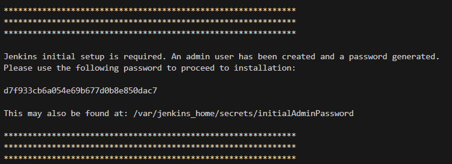
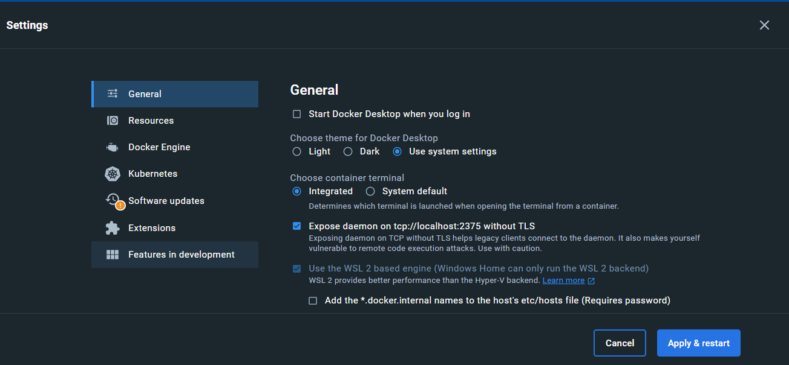

# Jenkins Docker

This is a really simple tutorial to deploy the jenkins docker image.
There is a tutorial adapted for:
- [Linux](#on-linux)
- [Windows](#on-windows)

## On linux

 First of all, install docker running the `dockerInstall.sh` script (in this directory):

> ./dockerInstall.sh

Then, you can deploy your jenkins image ! Simply run (still in this directory):

> ./DockerJenkIns.sh

While running the image, you will get in your terminal a **jenkins key** appears. Copy it.

For example, in this tutorial, they key to copy is `d7f933cb6a054e69b677d0b8e850dac7`. For you, it will be different. We will be needing it.

Open your browser and go to **JENKINS_URL:8080**, you will find a "Unlock Jenkins" page. In it, paste the **Jenkins key**, and select OK.

On the next page, Click **Install suggested plugins** and wait for the installation to finish. This might take a few minutes.

Then, create your admin user.

Enter you Jenkins URL and click "Save and Finish".

That's it ! Now you can head to [Jenkins pipelines creation](../JenkinsFiles/README.md) to create your differents pipelines.

## On Windows

First of all, install [docker desktop](https://docs.docker.com/desktop/install/windows-install/). Once installed and **running**, go to your docker desktop settings and select `Expose daemon on tcp://localhost:2375 without TLS`:

You can now use the following bat file to deploy jenkins:

> DockerJenkins.bat

While running the image, you will get in your terminal a **jenkins key** appears. Copy it.

For example, in this tutorial, they key to copy is `d7f933cb6a054e69b677d0b8e850dac7`. For you, it will be different. We will be needing it.

Open your browser and go to **JENKINS_URL:8080**, you will find a "Unlock Jenkins" page. In it, paste the **Jenkins key**, and select OK.

On the next page, Click **Install suggested plugins** and wait for the installation to finish. This might take a few minutes.

Then, create your admin user.

Enter you Jenkins URL and click "Save and Finish".

That's it ! Now you can head to [Jenkins pipelines creation](../JenkinsFiles/README.md) to create your differents pipelines.